在大陆服务器上部署项目时，经常需要从拉取境外的数据例如代码库、Docker 镜像、模型，此时大概率会碰到网络连接问题，非常让人恼火。本篇文章将会介绍使用 Cloudflare Workers 免费版搭建反向代理的流程，通过搭建反向代理，可以实现以下功能：

- 直链下载加速。

    - 如：GitHub repo 克隆、GitHub release 下载、wget 下载。

- 屏蔽站点访问。

    - 如：Docker 镜像拉取、Hugging Face 模型下载、OpenAI API 访问。

- 反盗链绕过。

    - 如：绕过 Pixiv 图片直链反盗链。

- 开启跨域。

    - 如：绕过他人提供的 API 的跨域限制。

本文部署方案需要的条件有：

- Cloudflare 免费版（及以上）账号

- 任意未被屏蔽的域名

# 1 原理

在跨境拉取数据时，若源站被防火墙阻断了，那显然是无法建立连接的。即使源站未被防火墙阻断，也有可能因为跨境路由质量太差而导致连接稳定性差、速度不佳。

另一种情况是源站开启了反盗链或配置了跨域限制，浏览器进行访问时由于请求头不合法会被反盗链拦截，或者返回的响应不允许跨域导致浏览器终止连接。

这几种情况如下图所示：

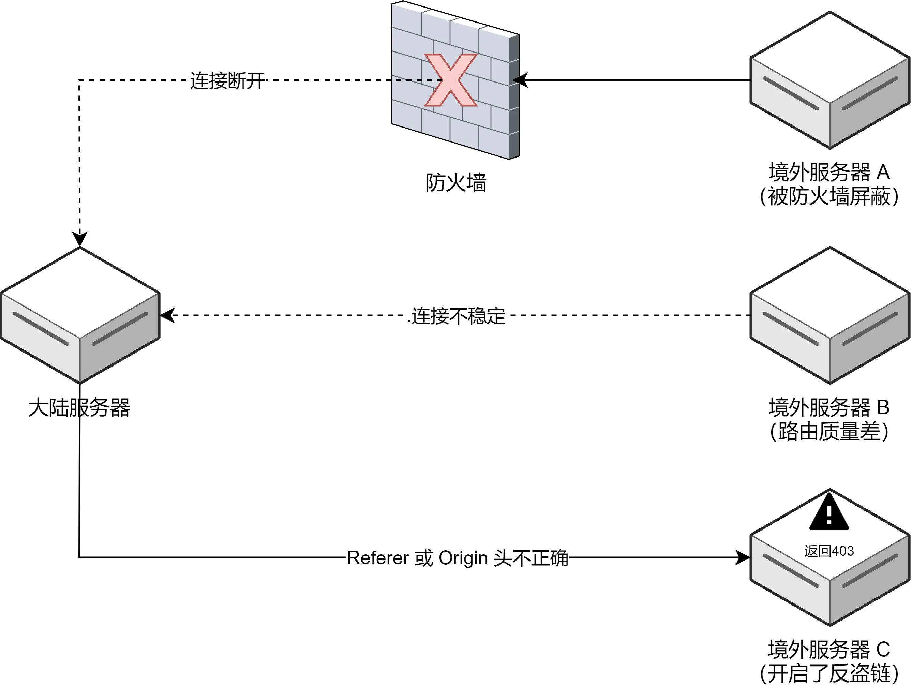

为了解决这个问题，我们可以通过一个中转服务器，对源站进行反向代理，从而解除这些限制。此时，这个中转服务器需要满足几个要求：未被防火墙屏蔽、跨境路由较为优秀、能够修改请求头和响应头。

Cloudflare Workers 能够完美满足上述要求，于是我们可以构建如图结构：

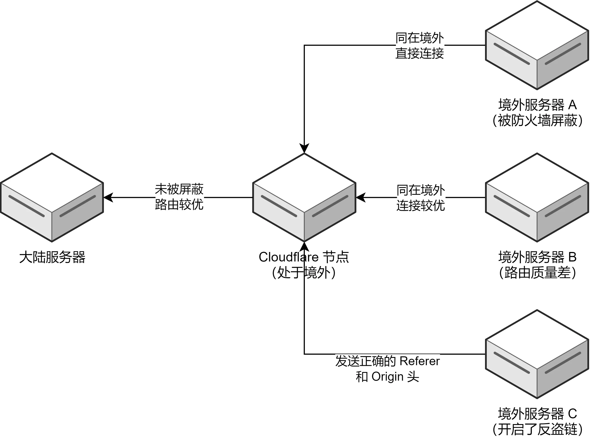

# 2 部署代码

## 2.1 注册 Cloudflare 账号

首先前往 [https://dash.cloudflare.com/sign-up](https://dash.cloudflare.com/sign-up) 注册 Cloudflare 账号，若已经有账号那直接前往 [https://dash.cloudflare.com/login](https://dash.cloudflare.com/login) 登录即可。

## 2.2 创建并配置 Workers

在 Cloudflare 的面板左侧选择 Workers 选项卡，然后点击右侧的“创建应用程序”按钮。然后点击新页面的“创建 Worker”按钮，命名后直接点击部署即可。

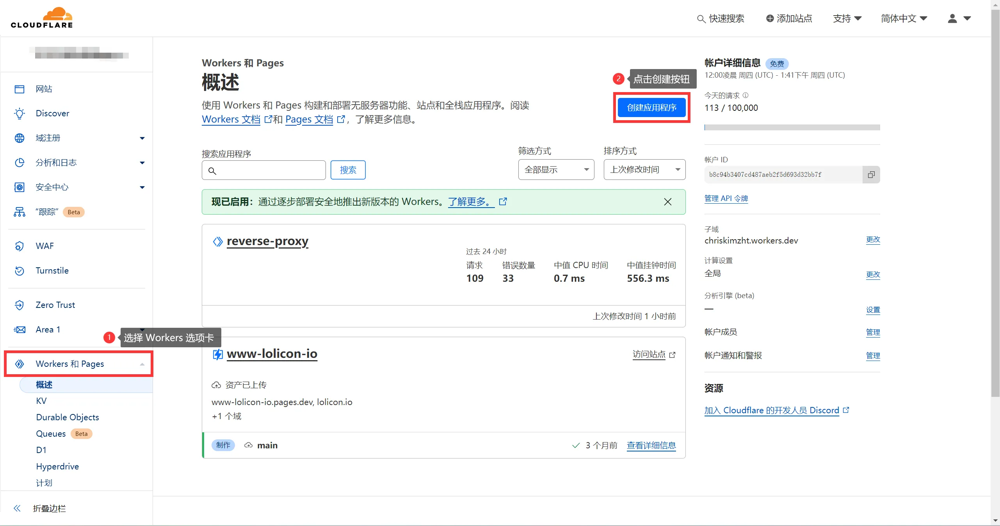

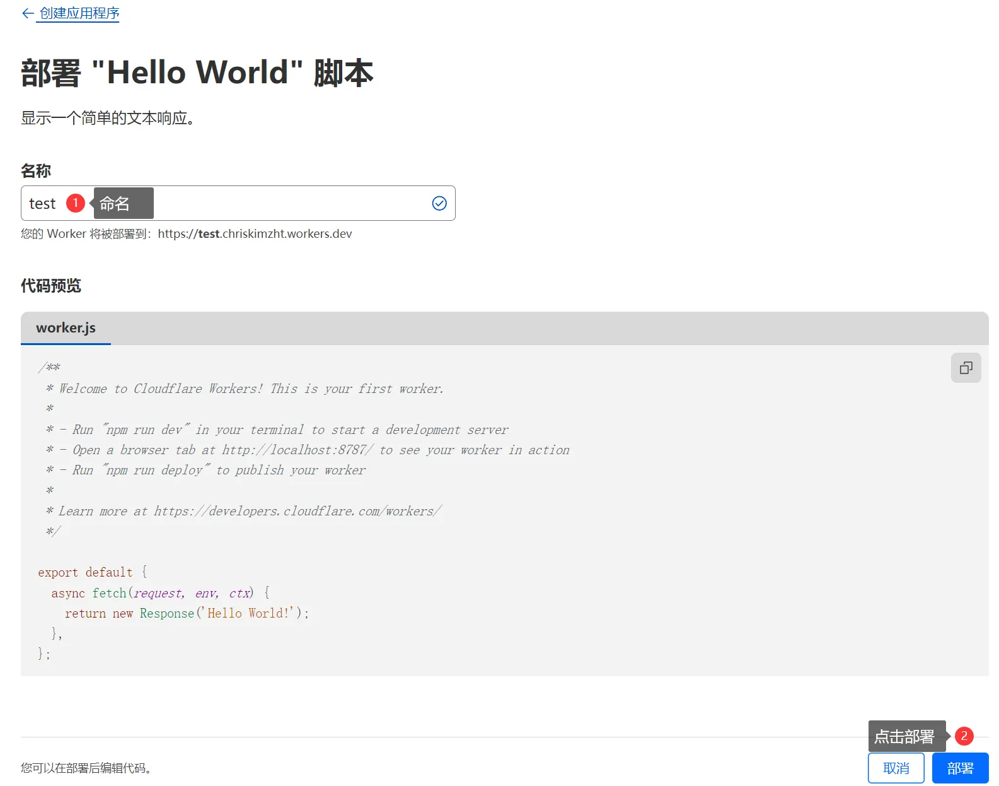

创建后，我们点击新页面的“编辑代码”按钮，进入代码编辑页面，然后将以下代码覆盖掉左侧代码框的内容。

```Shell
addEventListener('fetch', event => {
  event.respondWith(handleRequest(event.request))
})
const specialCases = {
  "*": {
    "Origin": "DELETE",
    "Referer": "DELETE"
  }
}
function handleSpecialCases(request) {
  const url = new URL(request.url);
  const rules = specialCases[url.hostname] || specialCases["*"];
  for (const [key, value] of Object.entries(rules)) {
    switch (value) {
      case "KEEP":
        break;
      case "DELETE":
        request.headers.delete(key);
        break;
      default:
        request.headers.set(key, value);
        break;
    }
  }
}
async function handleRequest(request) {
  const url = new URL(request.url);
  if (url.pathname === "/") {
    return new Response("Please enter the link after the /")
  };
  const actualUrlStr = url.pathname.replace("/", "") + url.search + url.hash;
  const actualUrl = new URL(actualUrlStr);
  const modifiedRequest = new Request(actualUrl, {
    headers: request.headers,
    method: request.method,
    body: request.body,
    redirect: 'follow'
  });
  handleSpecialCases(modifiedRequest);
  const response = await fetch(modifiedRequest);
  const modifiedResponse = new Response(response.body, response);
  modifiedResponse.headers.set('Access-Control-Allow-Origin', '*');
  return modifiedResponse;
}
```

然后点击右上角部署，即可将代码部署到 Worker：

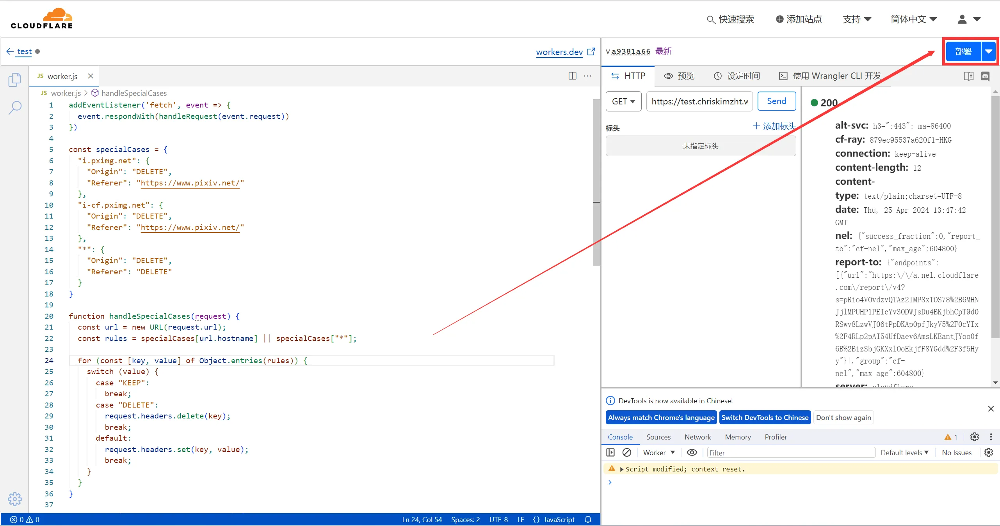

## 2.3 测试运行情况

部署后，在设置->触发器->路由找到 Worker 的访问链接：

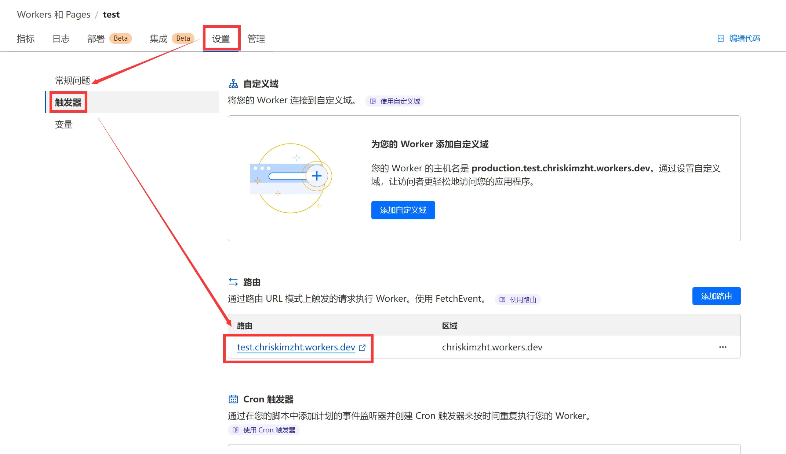

通过浏览器访问该链接，应该会返回以下信息：`Please enter the link after the /`

**当然，大概率你是会卡住，没办法直接访问到这个页面的。因为 workers.dev 这个域名是被 SNI 阻断的，在境内不可连接。这就是为什么我们需要准备一个域名了。**

## 2.4 绑定域名

我们首先要将自己的域名 DNS 托管给 Cloudflare，我们在控制台选择“网站”选项卡，然后点击”添加站点“按钮，根据 Cloudflare 的提示将 DNS 更改为 Cloudflare.

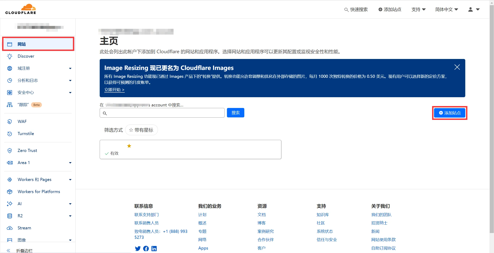

添加域名后，再进入刚才创建的 Cloudflare Worker 页面，点击添加”自定义域“，即可完成域名绑定了。

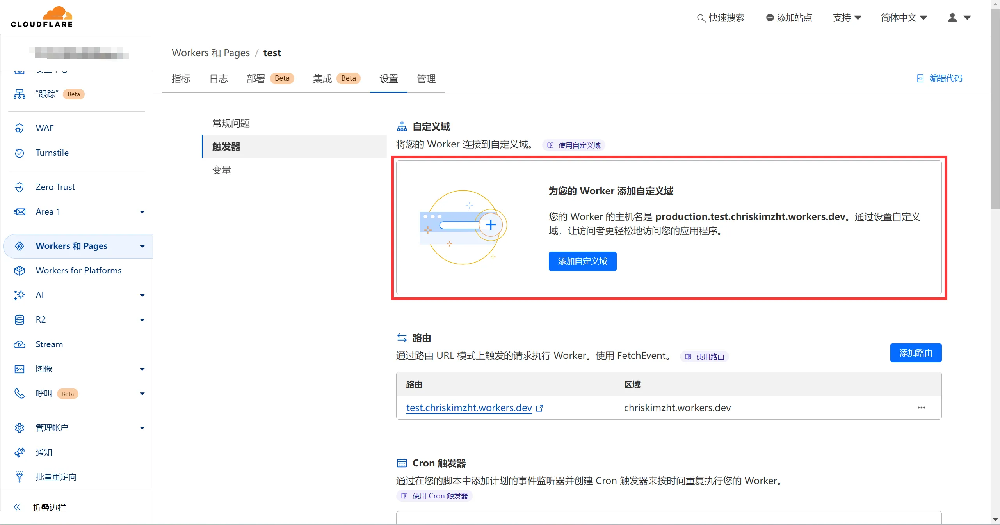

因为 Cloudflare Workers 只是被 SNI 干扰，并没有直接被屏蔽。因此绑定自定义域名后，我们用自己的域名是可以直接访问到的。并且 Cloudflare 的路由质量还是非常不错的，因此直连速度还是不错的。

## 2.5 使用方式

这个代码的使用方式非常简单，将自己要加速的链接跟在 / 后面就行了。例如：

- 原始链接：https://www.example.com/example.zip

- 加速链接：https://<你绑定的 Worker 域名>/https://www.example.com/example.zip

## 2.6 反盗链特判

可以发现我提供的代码内特意写了 specialCases 处理，这个是为了处理一些网站的反盗链规则。规则的配置格式如下所示：

```Shell
<域名>: {
  "Origin": <Origin规则>,
  "Referer": <Referer规则>
}
```

其中，Origin 规则和 Referer 规则的取值可以为：

- DELETE: 删除该请求头

- KEEP: 保持请求头不变

- 自定义: 将请求头更改为指定的值

例如 Pixiv 的图片直链 CDN 限制了 Referer 来源是 https://www.pixiv.net/，那么我们就可以配置以下规则：

```Shell
const specialCases = {
  "i.pximg.net": {
    "Origin": "DELETE",
    "Referer": "https://www.pixiv.net/"
  },
  "i-cf.pximg.net": {
    "Origin": "DELETE",
    "Referer": "https://www.pixiv.net/"
  },
  "*": {
    "Origin": "DELETE",
    "Referer": "DELETE"
  }
}
```

需要注意的是，* 规则代表未匹配的其他所有站点，建议保持不变。

## 2.7 Docker 使用

Docker Registry 的地址是 [https://registry.docker.com/](https://registry.docker.com/)，也是可以直接套这个反代使用的，即加速链接为：`https://<你绑定的 Worker 域名>/https://registry.docker.com/`

要配置 Registry 镜像，需要修改 `/etc/docker/daemon.json`，如果没有这个文件则新建，填写内容如下：

```Shell
{
  "registry-mirrors": [
    "https://<你绑定的 Worker 域名>/https://registry.docker.com/"
  ]
}
```

保存后重启 Docker 即可：`systemctl restart docker`

# 3 效果展示

使用阿里云上海服务器测试从 Huggingface 上下载 internlm2-chat-7b 模型。结果如下：

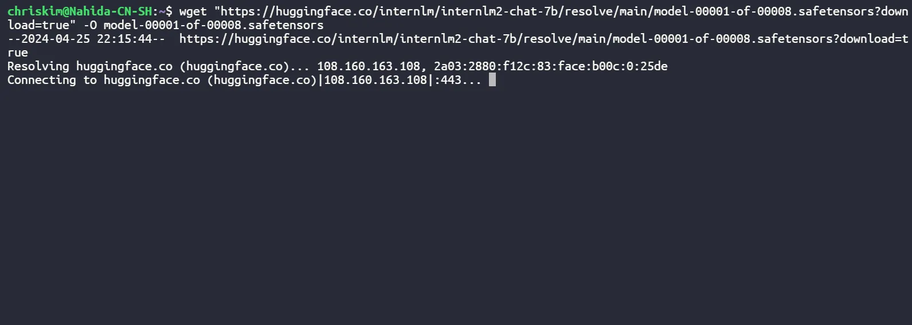

直连：无法建立连接

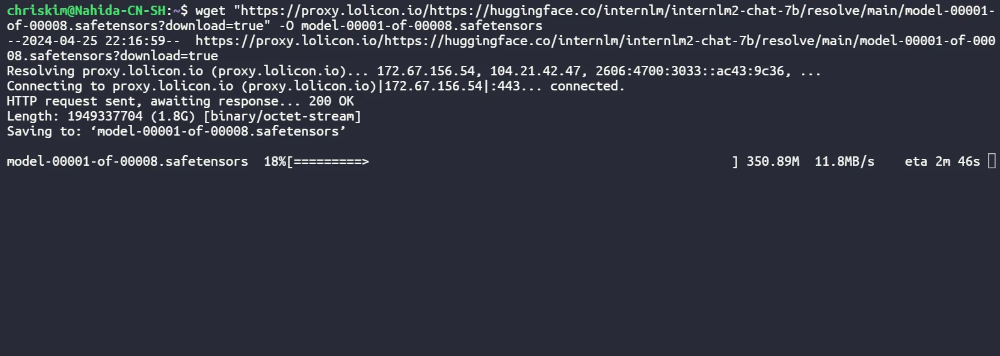

加速：跑满服务器 12MB/s 下行限速

使用雨云宿迁服务器测试从 GitHub 克隆 ChrisKimZHT/shell-emulator 的代码，结果如下：

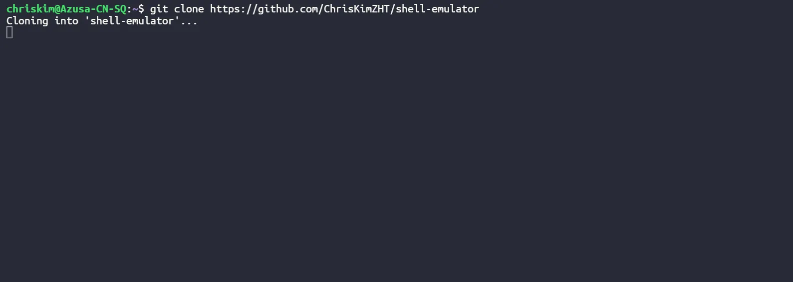

直连：直接卡死

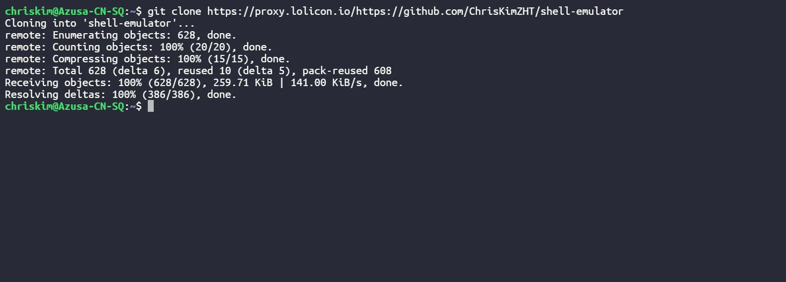

加速：顺利克隆

本人自己也使用了快半年，实测各大云服务器厂商服务器的网络连接 Cloudflare 都是很顺利的，因此在服务器上用它 clone 代码还是很舒服。不过在自己本地网络连接就有点看运气了，有时候是可以加速的，有时候一样很卡。可能云服务器的商业线路质量更高吧。

本文链接：[https://www.zouht.com/3740.html
](https://www.zouht.com/3740.html)本文使用：[CC BY-NC-SA 4.0](https://creativecommons.org/licenses/by-nc-sa/4.0/deed.zh) 许可

